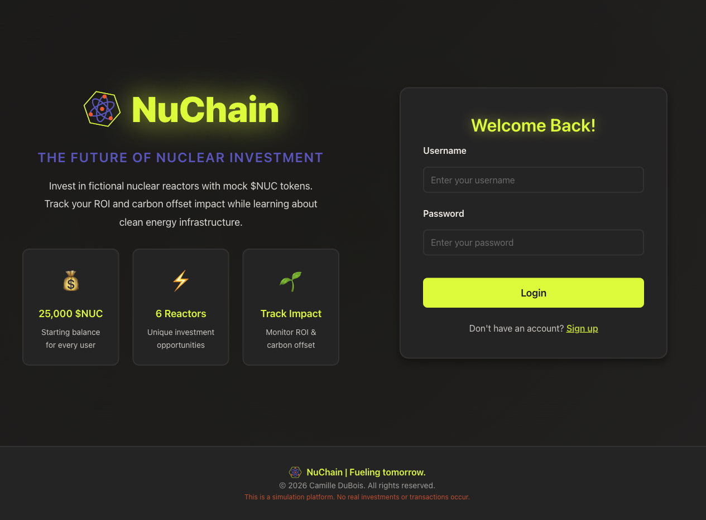
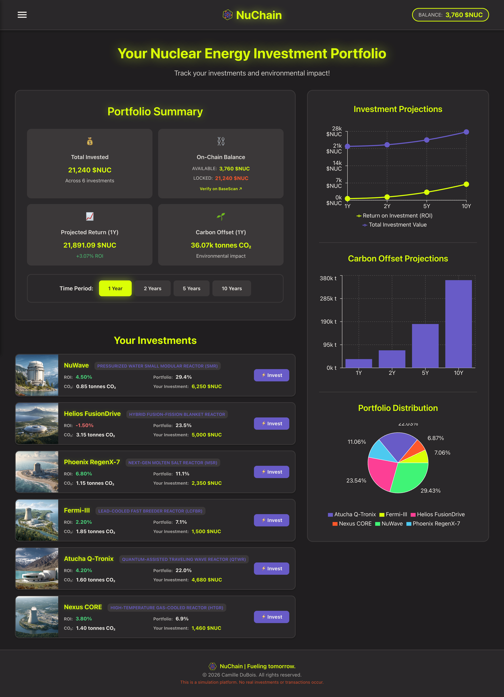
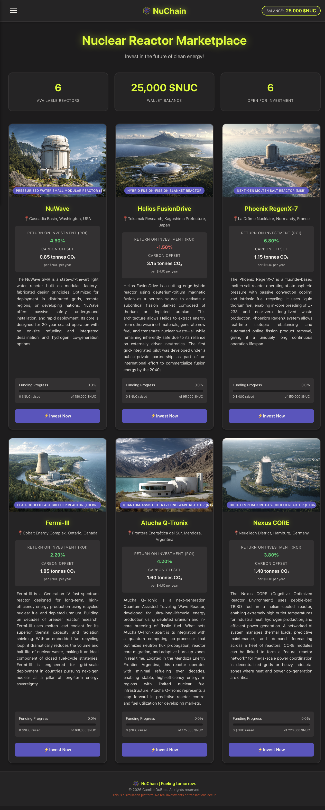
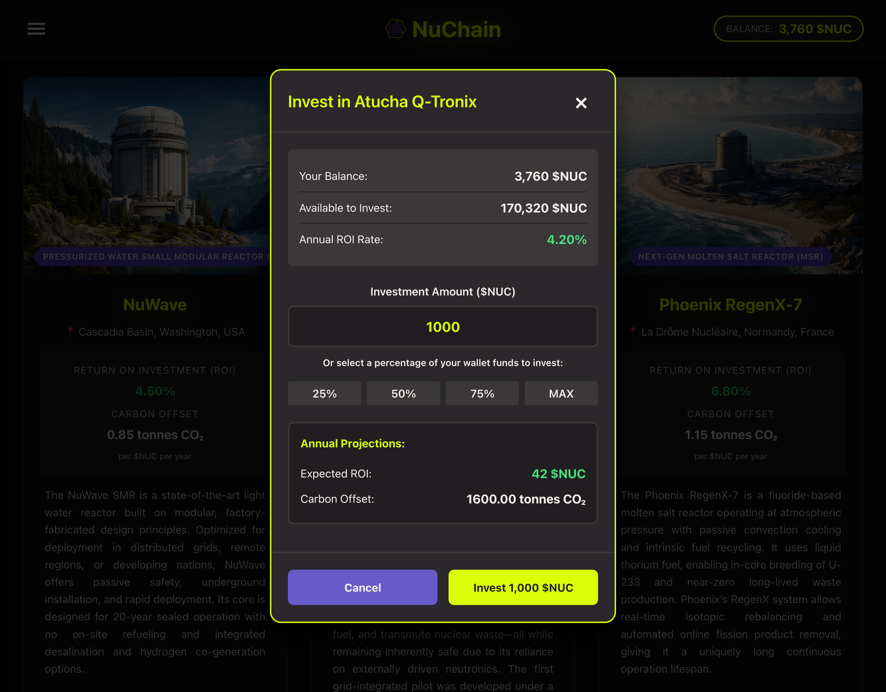
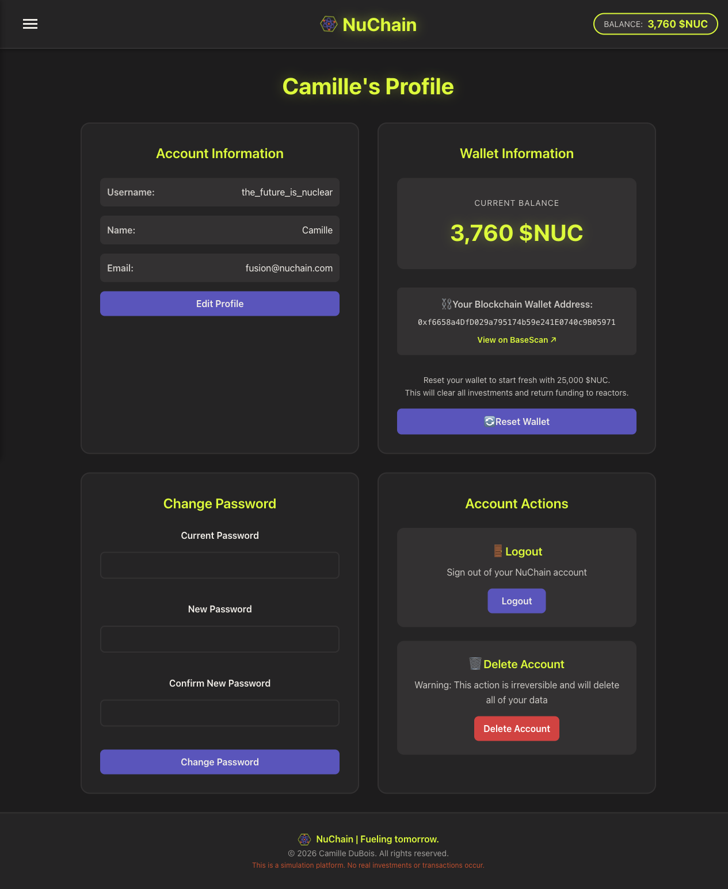

# ⚛️ NuChain - Nuclear Investment Simulation Platform

A fullstack web application with blockchain integration that simulates a decentralized investment platform for fictional nuclear power plants — a project demonstrating full-stack development, smart contract integration, and DeFi-style mechanics. Users receive mock crypto tokens ($NUC) to invest in virtual reactor projects while tracking simulated ROI and carbon offset impact.

## 🌟 Project Overview

NuChain bridges climate tech, energy infrastructure, and blockchain mechanics by offering an interactive platform where users receive real ERC-20 tokens (on testnet) to invest in virtual nuclear reactor projects. The platform tracks simulated ROI projections and carbon offset impact while all token operations are verifiable on-chain. The platform aims to help demystify both nuclear energy and tokenomics in a visually compelling and approachable way.

### Key Features

- **🔐 JWT Authentication** — Secure login/registration with token refresh
- **⛓️ Blockchain-Backed Wallet** — Real ERC-20 tokens on Base Sepolia testnet
- **⚡ Reactor Marketplace** — Browse and invest in 6 unique fictional nuclear reactors
- **📊 Portfolio Dashboard** — Track investments, ROI projections, and carbon offset impact
- **🌱 Environmental Impact** — Monitor CO₂ emissions offset through clean energy investments
- **📈 Interactive Charts** — Visualize investment performance over multiple time periods (1, 2, 5, 10 years)
- **🔗 On-Chain Verification** — All token operations verifiable via BaseScan

## 🎮 Live Demo

| Component | URL |
| --------- | --- |
| Frontend | [nuchain.vercel.app](https://nuchain.vercel.app) |
| Backend API | [nuchain-backend.onrender.com](https://nuchain-backend.onrender.com) |
| Smart Contract | [BaseScan](https://sepolia.basescan.org/address/0x7a8ed93c1eA030eC8F283e93Ff1BB008e57D4791) |

<!-- markdownlint-disable MD033 -->

### Screenshots

<p align="center">
  <strong>Welcome page</strong><br><br>
  <a href="docs/screenshots/welcome.png">
    
  </a>
</p>

<p align="center">―――</p>

<p align="center">
  <strong>Portfolio dashboard</strong><br><br>
  <a href="docs/screenshots/dashboard.png">
    
  </a>
</p>

<p align="center">―――</p>

<p align="center">
  <strong>Reactor marketplace</strong><br><br>
  <a href="docs/screenshots/reactors.png">
    
  </a>
</p>

<p align="center">―――</p>

<p align="center">
  <strong>Investment modal</strong><br><br>
  <a href="docs/screenshots/investment-modal.png">
    
  </a>
</p>

<p align="center">―――</p>

<p align="center">
  <strong>Profile with wallet info</strong><br><br>
  <a href="docs/screenshots/profile.png">
    
  </a>
</p>

<!-- markdownlint-enable MD033 -->

## 🏗️ Architecture

### Technology Stack

**Frontend:**

| Technology | Purpose |
| ---------- | ------- |
| React 19 | Component-based UI with hooks |
| TypeScript | Type safety and better DX |
| Vite | Fast builds and HMR |
| React Router | Client-side routing with protected routes |
| Recharts | Data visualization |
| Axios | HTTP client with JWT interceptors |

**Backend:**

| Technology | Purpose |
| ---------- | ------- |
| Django 5.2 | Web framework |
| Django REST Framework | RESTful API design |
| PostgreSQL | Production database |
| SimpleJWT | JWT authentication with token blacklisting |
| Web3.py | Ethereum/Base Sepolia blockchain integration |
| python-decouple | Environment variable management |

**Smart Contracts:**

| Technology | Purpose |
| ---------- | ------- |
| Solidity 0.8.28 | Smart contract language |
| OpenZeppelin | ERC-20 and Ownable base contracts |
| Base Sepolia | Layer 2 testnet deployment |

**Deployment:**

| Service | Component |
| ------- | --------- |
| Vercel | Frontend hosting |
| Render | Backend hosting |
| PostgreSQL | Production database |
| Base Sepolia | Blockchain network |

### Project Structure

```bash
nuchain/
├── nuchain-backend/
│   ├── apps/
│   │   ├── blockchain/      # Web3.py integration
│   │   ├── common/          # Shared test utilities
│   │   ├── users/           # Authentication & profiles
│   │   ├── reactors/        # Reactor models & data
│   │   └── investments/     # Investment logic & portfolio
│   ├── nuchain_backend/     # Django project settings
│   └── requirements.txt
├── nuchain-frontend/
│   ├── src/
│   │   ├── components/      # Reusable UI components
│   │   ├── pages/           # Route-level components
│   │   ├── services/        # API communication
│   │   ├── contexts/        # Auth state management
│   │   ├── hooks/           # Custom React hooks
│   │   ├── types/           # TypeScript interfaces
│   │   ├── utils/           # Helpers and constants
│   │   └── styles/          # Global styles
│   └── package.json
├── nuchain-contracts/
│   ├── contracts/
│   │   └── NucToken.sol     # ERC-20 token contract
│   └── hardhat.config.ts
└── README.md
```

## ⛓️ Blockchain Integration

NuChain uses a custom ERC-20 token deployed on Base Sepolia testnet. All token operations are executed on-chain and verifiable.

### Token Details

| Property | Value |
| -------- | ----- |
| Name | NuChain Token |
| Symbol | NUC |
| Contract | `0x7a8ed93c1eA030eC8F283e93Ff1BB008e57D4791` |
| Network | Base Sepolia |
| Chain ID | 84532 |
| Decimals | 18 |

### Token Operations

| User Action | Blockchain Effect |
| ----------- | ----------------- |
| Register | Mint 25,000 NUC to new wallet |
| Invest in Reactor | Lock tokens (cannot transfer) |
| Reset Portfolio | Unlock all locked tokens |
| Delete Account | Burn all tokens |

All transactions are verifiable on [BaseScan](https://sepolia.basescan.org/address/0x7a8ed93c1eA030eC8F283e93Ff1BB008e57D4791).

> **Note:** This is a testnet deployment for educational purposes — tokens have no real monetary value.

## 🚀 Quick Start

### Prerequisites

- Node.js 18+ and npm
- Python 3.11+
- PostgreSQL 14+
- Git

### Installation

1. **Clone the repository**

   ```bash
   git clone https://github.com/c-dubois/nuchain.git
   cd nuchain
   ```

2. **Backend Setup**

   ```bash
   cd nuchain-backend
   python -m venv venv
   source venv/bin/activate  # On Windows: venv\Scripts\activate
   pip install -r requirements.txt
   
   # Set up environment variables
   cp .env.example .env
   # Edit .env with your credentials
   
   # Run migrations and create sample data
   python manage.py migrate
   python manage.py create_reactors
   
   # Start development server
   python manage.py runserver
   ```

3. **Frontend Setup**

   ```bash
   cd nuchain-frontend
   npm install
   
   # Set up environment variables
   cp .env.example .env
   # Edit .env with your API URL
   
   # Start development server
   npm run dev
   ```

4. **Access the application**
   - Frontend: [http://localhost:3000](http://localhost:3000)
   - Backend API: [http://localhost:8000](http://localhost:8000)

## 🕹️ How to Use

1. **Create Account**: Sign up with a username, email, and password (mints 25,000 $NUC tokens)
2. **Explore Reactors**: Browse the 6 available nuclear reactor projects
3. **Make Investments**: Allocate your 25,000 $NUC tokens across reactors (locks tokens on-chain)
4. **Track Performance**: Monitor portfolio ROI and carbon offset projections
5. **Reset & Retry**: Use wallet reset feature to unlock all tokens and start over with fresh capital

## ⚡️ Reactor Profiles

The platform features 6 unique fictional reactors with varying risk/reward characteristics:

| Reactor | Type | Annual ROI |
| ------- | ---- | ---------- |
| NuWave | Small Modular Reactor (SMR) | 4.5% |
| Helios FusionDrive | Fusion-Fission Hybrid | -1.5% |
| Phoenix RegenX-7 | Molten Salt Reactor (MSR) | 6.8% |
| Fermi-III | Lead-Cooled Fast Breeder (LCFBR) | 2.2% |
| Atucha Q-Tronix | Quantum-Assisted Traveling Wave (QTWR) | 4.2% |
| Nexus CORE | High-Temperature Gas-Cooled (HTGR) | 3.8% |

## 🔧 Environment Variables

### Backend (.env)

```env
# Django
SECRET_KEY=your-secret-key
DEBUG=True
ALLOWED_HOSTS=localhost,127.0.0.1
CORS_ALLOWED_ORIGINS=http://localhost:3000,http://127.0.0.1:3000

# Database
DB_NAME=nuchain_db
DB_USER=nuchain_user
DB_PASSWORD=your_password
DB_HOST=localhost
DB_PORT=5432

# Blockchain
BASE_SEPOLIA_RPC_URL=https://base-sepolia-rpc.publicnode.com
NUC_CONTRACT_ADDRESS=0x7a8ed93c1eA030eC8F283e93Ff1BB008e57D4791
ADMIN_PRIVATE_KEY=your-admin-wallet-private-key
```

### Frontend (.env)

```env
VITE_API_URL=http://localhost:8000/api
VITE_CLOUD_NAME=your-cloudinary-name
```

## 🧪 Testing

**Backend:**

```bash
cd nuchain-backend
python manage.py test

# With coverage
coverage run --source='.' manage.py test
coverage report
```

**Frontend:**

```bash
cd nuchain-frontend
npm test
```

## 🚀 Deployment

### Backend (Render)

1. Create a new Web Service on Render
2. Connect your GitHub repository
3. Configure environment variables (including blockchain vars)
4. Deploy with the provided `build.sh` script

### Frontend (Vercel)

1. Connect your repository
2. Set build command: `npm run build`
3. Set output directory: `dist`
4. Configure environment variables

## 🙏 Acknowledgments

- Nuclear reactor designs inspired by real-world Gen IV reactor concepts
- Simulated climate data designed for educational purposes
- User interface and investment process inspired by leading decentralized finance protocols

## ⚠️ Disclaimer

NuChain is an educational simulation platform deployed on testnet. No real investments, monetary transactions, or nuclear reactors are involved. All reactor data, financial projections, and token values are fictional and for demonstration purposes only. $NUC tokens exist on Base Sepolia testnet and have no real-world value.

---

### Built with ⚛️ by [Camille DuBois](https://github.com/c-dubois)
